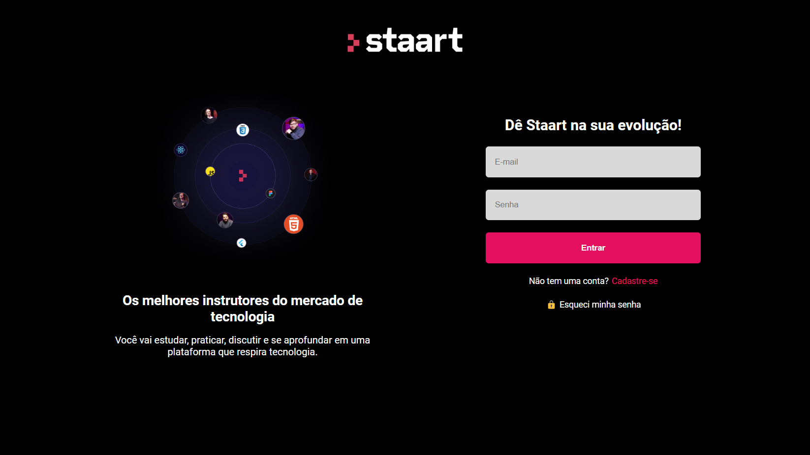

# Staart Front-end App

  

## 📑 Descrição

Esta aplicação consiste no projeto final da jornada de front-end, proposto para os alunos da plataforma [Staart](https://staart.com/).
O projeto se baseia na criação de uma plataforma de estudos semelhante a própria [Staart](https://staart.com/), onde, foi necessário a criação de um layout próprio, além de lidar com os fluxos de uma API criada e disponibilizada previamente para o desenvolvimento da aplicação, que contempla jornadas, cursos e aulas, bem como, as suas respectivas informações detalhadas.

## 🔗 Funcionalidades do Projeto

* ``Login:`` página inicial do projeto, a qual o usuário deverá efetuar o processo de login inserindo um endereço de e-mail e uma senha, que deverá conter no mínimo 6 caracteres. Essa mesma página contempla um link que redireciona para a página de criação de usuário, em caso de primeiro acesso, e um link que redireciona para a página de "Esqueci minha senha", caso o usuário já tenha um cadastro mas, por algum motivo, tenha interesse em redefinir a sua senha.

* ``Cadastro:`` página que propicia a criação de um novo usuário, a qual o mesmo deverá preencher todos os campos solicitados, sendo estes: Nome Completo, E-mail e Senha. Essa página contempla também um link para a página inicial ("Já tenho uma conta"), em caso de equivoco do usuário que já possua um cadastro.

* ``Esqueci minha senha:`` página que tem como finalidade redefinir uma senha para o usuário cadastrado. O funcionamento consiste na inserção do endereço de e-mail no campo solicitado, por parte do usuário, que ao clicar no botão enviar, receberá na sua caixa de e-mail um link para que possa ser estabelecida uma nova senha. Essa página contempla também um link para a página inicial ("Já tenho uma conta"), em caso de equivoco do usuário que já possua um cadastro e não tenha o interesse de redefinir a sua senha.

* ``Jornadas:`` página a ser visualizada após sucesso na autenticação de e-mail e senha do usuário. Essa página consiste na listagem das jornadas disponíveis na API, um botão de "Sair" para efetuar logout do usuário, além de um filtro, que possibilita o usuário ordenar a listagem das jornadas de acordo com a quantidade de cursos (da maior para a menor), ordem alfabética ou o padrão de retorno da própria API. Cada jornada listada condiz a um link que a direciona para os seus respectivos cursos.

* ``Cursos:`` página que corresponde a listagem dos cursos, de acordo com a jornada selecionada. A página contempla a logo da staart (link), que ao clicar retorna para a página de listagem das jornadas, um botão de "Voltar", que retorna para a página de listagem das jornadas, o título e a descrição da jornada, bem como, uma lista com os seus respectivos cursos. Cada curso listado consiste em um link de direcionamento para as suas respectivas aulas.

* ``Aulas:`` página que apresenta a listagem dos módulos e aulas de um determinado curso. A página contempla a logo da staart (link), que ao clicar retorna para a página de listagem das jornadas, um botão de "Voltar", que retorna para a página de listagem dos cursos da jornada em que se encontra a aula, o título e a descrição do curso, e uma listagem de todas as aulas, logo abaixo dos seus respectivos módulos.

## 💻 Tecnologias utilizadas

Para o desenvolvimento deste projeto, as seguintes linguagens e ferramentas foram utilizadas:

* [CSS](https://developer.mozilla.org/pt-BR/docs/Web/CSS)
* [Firebase](https://firebase.google.com/)
* [React](https://reactjs.org/)
* [React Router](https://reactrouter.com/en/main)
* [Vercel](https://vercel.com/)
* [Vite](https://vitejs.dev/)

## 🚀 Deploy

Clique no link abaixo para acessar o projeto 👇🏾

* [Staart Front-End App](https://staart-frontend.vercel.app/)